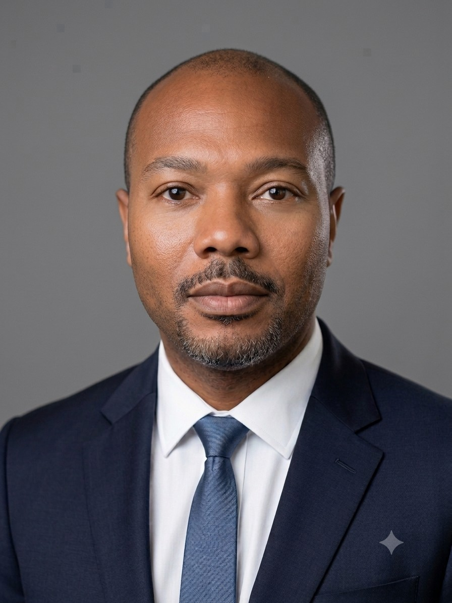

# Antoine Davis

## About Me

Hello, my name is Antoine Davis. I am a General Engineer with experience supporting Department of Defense construction, infrastructure, and facilities improvement programs. I currently support federal infrastructure and facilities engineering projects involving project planning, engineering design review, contractor coordination, budgeting, and facilities compliance.

I earned a Bachelor of Science in Electrical and Electronics Engineering Technology from ECPI University and I am currently pursuing a Master of Science in Electrical Engineering at Old Dominion University. My professional background includes engineering experience with the Department of the Air Force, Marine Systems Corporation, Amazon, and the United States Navy.

My interests include electrical engineering, infrastructure modernization, cybersecurity, data analytics, and emerging technologies. I am passionate about continuous learning and using engineering solutions to solve real-world problems.

## Resume

[View My Resume](Antoine Davis Resume2026.pdf)

## Skills

- AutoCAD
- ArcGIS
- Microsoft Project
- SharePoint
- Blueprint Interpretation
- Technical Documentation
- Infrastructure Planning
- Construction Coordination
- Data Analysis
- Engineering Project Tracking

## Education

**Master of Science in Electrical Engineering**  
Old Dominion University  
In Progress

**Bachelor of Science in Electrical & Electronics Engineering Technology**  
ECPI University
